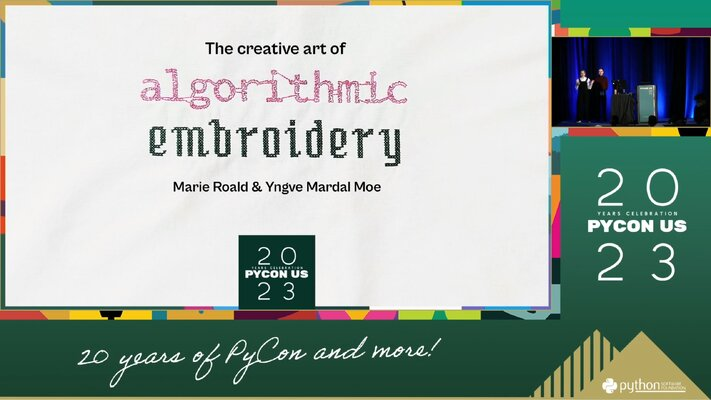

# The creative art of algorithmic embroidery 
## Presented at PyCon US 2023

Watch the talk on [YouTube](https://youtu.be/OcuhrDIrblo).

## Description
For thousands of years, people have created beautiful patterns through intricate needlework.
Many of these patterns utilize algorithmic concepts like repetition, recursion and variation to build complex motives from simple rules.
In this talk, we explore the art of embroidery through Python programming and show how you can create your own patterns with code.

We will turn straightforward commands into elaborate and intricate artworks with loops, randomness and recursive functions using only the built-in turtle library in Python.
Then, we will show how you can turn your art into embroidery patterns that are readable by an embroidery machine using the TurtleThread library and how you can use Python to create decorative ornaments for your Christmas tree.
This talk is for anyone interested in the intersection between Python programming, creative coding and arts and crafts!

## References
### Embroidery

#### General history of embroidery
* *Batsford Encyclopaedia of Embroidery Techniques* by Gay Swift ([archive.org](https://archive.org/details/larousseencyclop0000swif))
* *Three hundred years of embroidery 1600-1900 - Treasures from the Collection of the Embroiderers' Guild of Great Britain* by Pauline Johnstone ([archive.org](https://archive.org/details/threehundredyear0000john/))

#### Sashiko
* *Japanese Quilting: Sashiko* ([archive.org](https://archive.org/details/sashikobeyondtec0000taka), old edition) ([Batsford](https://www.batsfordbooks.com/book/japanese-quilting-sashiko/), paid e-book with DRM)
* *Sashiko Story* by Atsushi Futatsuya ([YouTube](https://www.youtube.com/@SashikoStory))
* *Upcycle Stitches* ([upcyclestitches.com](https://upcyclestitches.com/))

#### Blackwork embroidery
* *Blackwork* by Mary Gostelow ([archive.org](https://archive.org/details/blackwork0000gost))
* *Blackwork Embroidery* by ElisabethGeddes and Moyra McNeill ([archive.org](https://archive.org/details/blackworkembroid00gedd))
* *The art of Blackwork Embroidery* by Rosemary Drysdale ([archive.org](https://archive.org/details/artofblackworkem00drys))

#### Norwegian embroidery
* *Hardanger Embroidery* by Sigrid Bright ([archive.org](https://archive.org/details/hardangerembroid0000brig/))
* *Hardangersaum* by Gudrun Stuland - In Norwegian ([nb.no](https://www.nb.no/items/59d5a8292e3e3a13c3f8072633d535ca), requires Norwegian IP address)
* *Hol- og svartsaum* by Gudrun Stuland - In Norwegian ([nb.no](https://www.nb.no/items/71a12dc2068c5c9d2f10cdffa2f58d49), requires Norwegian IP address )

#### Modern embroidery
* *Stitch and Pattern* by Jean Draper ([Batsford](https://www.batsfordbooks.com/book/stitch-and-pattern/), paid e-book with DRM)

### Computer Art
#### Classical computer art (1960s)
* *Database of Digital Art* by Frieder Nake ([dada.compart-bremen.de](dada.compart-bremen.de))
* *A Michael Noll* ([noll.uscannenberg.org](noll.uscannenberg.org]))
* *Generative Computergraphik* by Georg Nees (PhD Thesis, available at the [OsloMet university library](https://bibsys-almaprimo.hosted.exlibrisgroup.com/primo-explore/fulldisplay?docid=TN_cdi_proquest_ebookcentral_EBC5116331&context=PC&vid=HIOA&lang=en_US)). 
* *Digital Art* by Wolf Lieser ([archive.org](https://archive.org/details/digitalart0000lies))

#### 10 Print
* *10 PRINT CHR$(205.5+RND(1)); : GOTO 10* by Nick Montfort and others (PDF available on [10print.org](https://10print.org/))

#### Fractals
* *The Algorithmic Beauty of Plants* By Przemyslaw Prusinkiewicz and Aristid Lindenmayer (PDF available on [algorithmicbotany.org](http://algorithmicbotany.org/papers/#abop))
* *Lindenmayer Systems, Fractals, and Plants* By Przemyslaw Prusinkiewicz and James Hanan (PDF available on [algorithmicbotany.org](http://algorithmicbotany.org/papers/#lsfp))

#### Creative coding
* *The Coding Train* by Daniel Shiffman ([YouTube](https://www.youtube.com/@TheCodingTrain)) ([thecodingtrain.com](https://thecodingtrain.com/))
